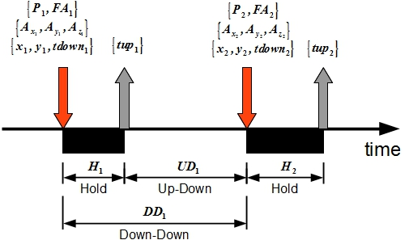

# User-Authentication-based-on-Keystroke-dynamics

## Introduction
User authentication is being hackable by social engineering techniques, which is leading to the migration of authentication methods to biometric-based authentications.
In this project, we developed a a deep learning Neural netowrk model and a demo of user authentication using keystroke dynamics by extracting features of the sequence of keystroke analytics and dynamics of user’s passwords logging into a system. 

We aim to identify users based on their keystrokes, so we decided to make it a multi-classification matter to make each user able to log in as his identity only; if the users try to log in to another account of another user, he will be detected as a fraud since the credentials do not match the username. In case of having a person outside the users that try to log in as any user, even if the password is known, since the keystroke dynamics will not match the threshold of probability of the user’s keystroke dynamics, the system will detect that he is a fraud, thus he will not be able to log in.

## Dataset
This project uses the CMU Keystroke Dynamics Benchmark Dataset. The dataset is conducted of keystroke dynamics of 51 users typing the password (.tie5Roanl) 400 times, collected over 8 sessions with 50 repetitions each.
The dataset contains three main features while typing the password for each key jumping; the Hold Time, the Down-Down time, and the Up-Down time. 
<ul>
  <li>Hold time: The duration time between pressing and releasing the same key.
</li>
  <li>Down-Down time: The duration time between pressing the key and pressing the following key.
</li>
  <li>Up-Down time: The duration time between releasing a key and pressing the following key.
</li>
</ul>

 

## Pre-Processing
Having the dataset storing 34 features, only 31 got used, which were the keystroke dynamics, while dropping the user, lap, and session information, making the shape of the model (31,20800).
After dropping unnecessary features, we used one-hot encoding for the data to select the highest probability of the detected user. Then we scaled our dataset features using standardization.
We divided the dataset into 90-10% for training and testing, and while training, we used 15% of the training data for validation.

## Model
Our model is a vanilla neural network using Keras in TensorFlow, we are using cross-entropy for the loss function and adam for optimization, and the model starts with 31 features as the input layer, in the 3 hidden layers we used rectified linear unit (ReLU), and sigmoid activation functions, and in the output layer, we used a SoftMax activation function to choose one of the 52 indicated users.
We also tested a Long Short-Term Memory (LSTM) neural network model, starting with 31 features as the input layer, and 3 hidden layers, which end in the output layer with the SoftMax activation function to choose one of the 52 indicated users (including one of us as an added user for testing purposes).

## Results
| Attempt | #NN    | #LSTM    |
| :-----: | :---: | :---: |
| Accuracy | 93.9   | 92.5   |
| Precision | 94.7   | 93.2   |
| Recall | 93.3   | 92.11   |
| F1-score | 94.0   | 92.64   |

## Feature Extraction
Our user interface extracts the three main features which were described in the dataset. These features are used as credentials for users to authenticate themselves.
Later, we added a new user representing one of us for testing feature extraction and user authentication in the designed user interface (UI) using our NN model.

## Refrences
<ul>
  <li>https://www.cs.cmu.edu/~keystroke/#ref1
</li>
  <li>https://www.ms.sapientia.ro/~manyi/mobikey.html
</ul>
